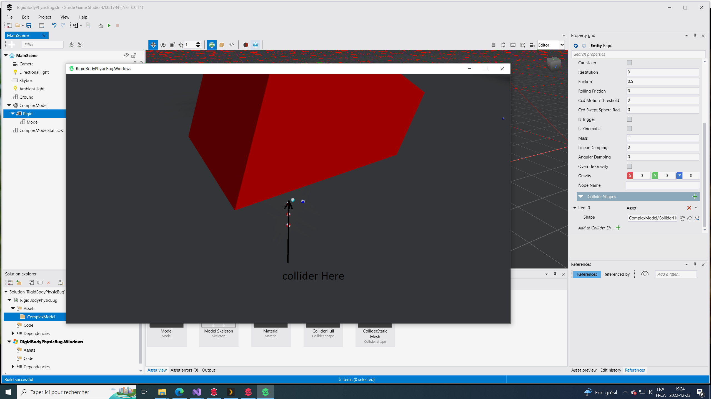

# RigidBodyPhysicBug

## Controls

Use WASD to move camera to a position where the collision with bullets can be properly observed
Use SpaceBar for Launch Ball

## Where to look

New margin property should show up on ColliderHull collider shape, in the Property grid. This collider shape is used on the
'Rigid' entity which is seen as a child of the 'ComplexModel' entity in the scene. mathmb1986 has a screenshot I will leave
in this project, it shows the bullet that the user can fire at the comvex model having a problemwith the collisions, an issue
where these margins can provide some ways to adjust.

### Before new margin field added:

After margin field added:

Note: margin field is shown on right side in highlighted box

### When playing (original screencap):

# Users Screencap

Note: Reports show that user wants to adjust the margin so the collision occurs closer to the mesh (so its much cleaner). This involves
adjusting a margin property. At the time of the issue margin seems to have some value that was present. With this fix we can set it to
zero or any value to add that buffer between the bullet and the 'ComplexModel' in the scene.

When testing in my build I am able to get the same interaction as orignally reported. There is an invisible collider that seems to extend
outside of the 'Rigid' entity that the balls cannot collide with.

# My capture from within current Stride Build

Note: This screenshot showcases with the fix implemented. Balls now collide directly to mesh with margin set to zero (Its default margin).
Balls show to now not have that invisible collider present.

## Additional Info

For testing and showcasing Issue: https://github.com/stride3d/stride/issues/1577

Most of source code taken from mathmd1986:
https://github.com/mathmb1986/RigidBodyPhysicBug/tree/master
when issue was originally reported.

Some great info provided from the original contributior who found and requested this enhancement:
https://www.youtube.com/watch?v=BGAwRKPlpCw

Issue #1577 (current Issue representing this enhancement):
https://github.com/stride3d/stride/issues/1577

Discussion Post (#1574) where enhancement was orignally presented:
https://github.com/stride3d/stride/discussions/1574
